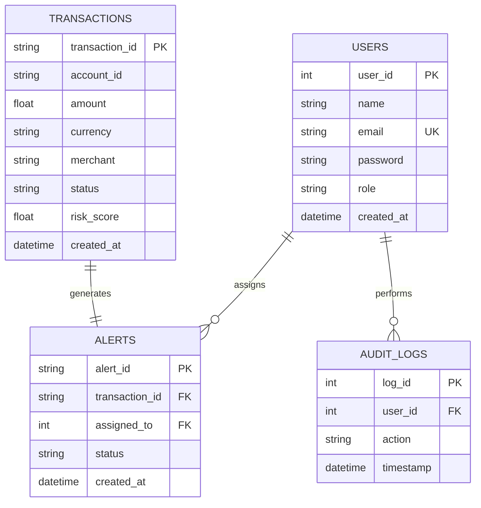

# ER Diagram – FinShield Analytics

```mermaid
erDiagram

USERS {
    int user_id PK
    string name
    string email UK
    string password
    string role
    datetime created_at
}

TRANSACTIONS {
    string transaction_id PK
    string account_id
    float amount
    string currency
    string merchant
    string status
    float risk_score
    datetime created_at
}

ALERTS {
    string alert_id PK
    string transaction_id FK
    int assigned_to FK
    string status
    datetime created_at
}

AUDIT_LOGS {
    int log_id PK
    int user_id FK
    string action
    datetime timestamp
}

USERS ||--o{ ALERTS : assigns
TRANSACTIONS ||--|| ALERTS : generates
USERS ||--o{ AUDIT_LOGS : performs

```