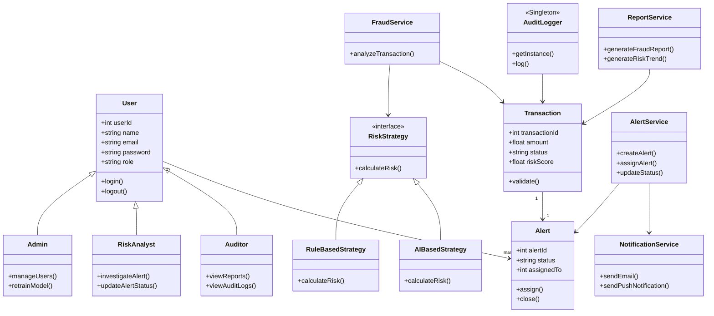

---

# 📄 classDiagram.md

# Class Diagram – FinShield Analytics

```mermaid
classDiagram

class User {
    +int userId
    +string name
    +string email
    +string password
    +string role
    +login()
    +logout()
}

class Admin {
    +manageUsers()
    +retrainModel()
}

class RiskAnalyst {
    +investigateAlert()
    +updateAlertStatus()
}

class Auditor {
    +viewReports()
    +viewAuditLogs()
}

User <|-- Admin
User <|-- RiskAnalyst
User <|-- Auditor

class Transaction {
    +int transactionId
    +float amount
    +string status
    +float riskScore
    +validate()
}

class FraudService {
    +analyzeTransaction()
}

class RiskStrategy {
    <<interface>>
    +calculateRisk()
}

class RuleBasedStrategy {
    +calculateRisk()
}

class AIBasedStrategy {
    +calculateRisk()
}

RiskStrategy <|-- RuleBasedStrategy
RiskStrategy <|-- AIBasedStrategy

FraudService --> RiskStrategy

class Alert {
    +int alertId
    +string status
    +int assignedTo
    +assign()
    +close()
}

class AlertService {
    +createAlert()
    +assignAlert()
    +updateStatus()
}

class NotificationService {
    +sendEmail()
    +sendPushNotification()
}

class AuditLogger {
    <<Singleton>>
    +getInstance()
    +log()
}

class ReportService {
    +generateFraudReport()
    +generateRiskTrend()
}

User "1" --> "many" Alert
Transaction "1" --> "1" Alert
AlertService --> Alert
AlertService --> NotificationService
FraudService --> Transaction
AuditLogger --> Transaction
ReportService --> Transaction
```