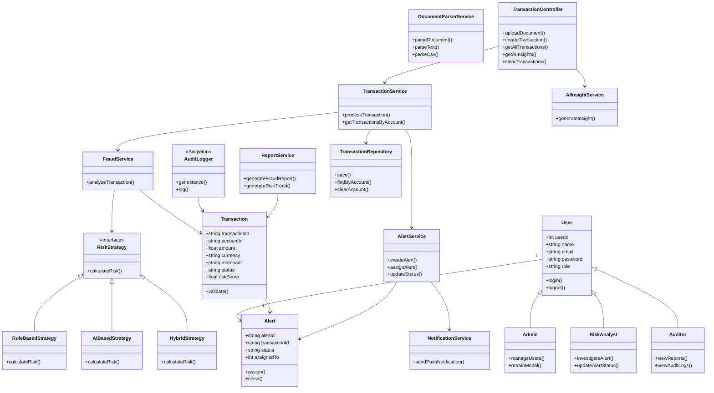

# Class Diagram – FinShield Analytics

```mermaid
classDiagram

class User {
    +int userId
    +string name
    +string email
    +string password
    +string role
    +login()
    +logout()
}

class Admin {
    +manageUsers()
    +retrainModel()
}

class RiskAnalyst {
    +investigateAlert()
    +updateAlertStatus()
}

class Auditor {
    +viewReports()
    +viewAuditLogs()
}

User <|-- Admin
User <|-- RiskAnalyst
User <|-- Auditor

class Transaction {
    +string transactionId
    +string accountId
    +float amount
    +string currency
    +string merchant
    +string status
    +float riskScore
    +validate()
}

class FraudService {
    +analyzeTransaction()
}

class RiskStrategy {
    <<interface>>
    +calculateRisk()
}

class RuleBasedStrategy {
    +calculateRisk()
}

class AIBasedStrategy {
    +calculateRisk()
}

class HybridStrategy {
    +calculateRisk()
}

RiskStrategy <|-- RuleBasedStrategy
RiskStrategy <|-- AIBasedStrategy
RiskStrategy <|-- HybridStrategy

FraudService --> RiskStrategy

class Alert {
    +string alertId
    +string transactionId
    +string status
    +int assignedTo
    +assign()
    +close()
}

class AlertService {
    +createAlert()
    +assignAlert()
    +updateStatus()
}

class NotificationService {
    +sendPushNotification()
}

class AuditLogger {
    <<Singleton>>
    +getInstance()
    +log()
}

class ReportService {
    +generateFraudReport()
    +generateRiskTrend()
}

class TransactionService {
    +processTransaction()
    +getTransactionsByAccount()
}

class TransactionRepository {
    +save()
    +findByAccount()
    +clearAccount()
}

class AIInsightService {
    +generateInsight()
}

class DocumentParserService {
    +parseDocument()
    +parseText()
    +parseCsv()
}

class TransactionController {
    +uploadDocument()
    +createTransaction()
    +getAllTransactions()
    +getAIInsights()
    +clearTransactions()
}

User "1" --> "many" Alert
Transaction "1" --> "1" Alert
AlertService --> Alert
AlertService --> NotificationService
FraudService --> Transaction
AuditLogger --> Transaction
ReportService --> Transaction
TransactionService --> TransactionRepository
TransactionService --> FraudService
TransactionService --> AlertService
TransactionController --> TransactionService
TransactionController --> AIInsightService
```