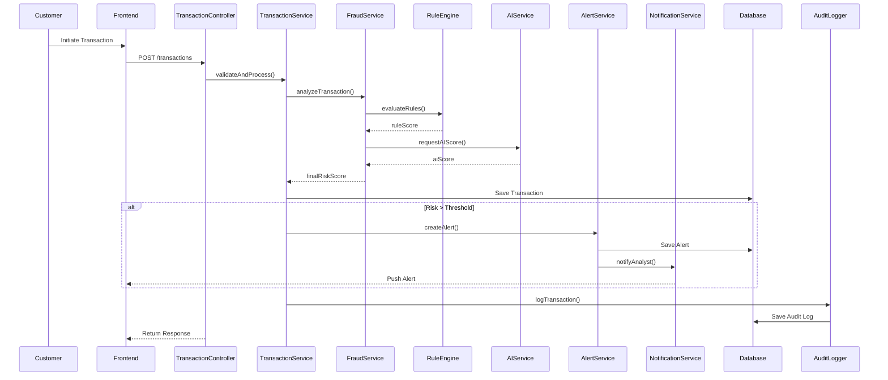

---

# 📄 sequenceDiagram.md

# Sequence Diagram – End-to-End Fraud Detection Flow

```mermaid
sequenceDiagram

participant Customer
participant Frontend
participant TransactionController
participant TransactionService
participant FraudService
participant RuleEngine
participant AIService
participant AlertService
participant NotificationService
participant Database
participant AuditLogger

Customer->>Frontend: Initiate Transaction
Frontend->>TransactionController: POST /transactions
TransactionController->>TransactionService: validateAndProcess()

TransactionService->>FraudService: analyzeTransaction()

FraudService->>RuleEngine: evaluateRules()
RuleEngine-->>FraudService: ruleScore

FraudService->>AIService: requestAIScore()
AIService-->>FraudService: aiScore

FraudService-->>TransactionService: finalRiskScore

TransactionService->>Database: Save Transaction

alt Risk > Threshold
    TransactionService->>AlertService: createAlert()
    AlertService->>Database: Save Alert
    AlertService->>NotificationService: notifyAnalyst()
    NotificationService-->>Frontend: Push Alert
end

TransactionService->>AuditLogger: logTransaction()
AuditLogger->>Database: Save Audit Log

TransactionController-->>Frontend: Return Response
```