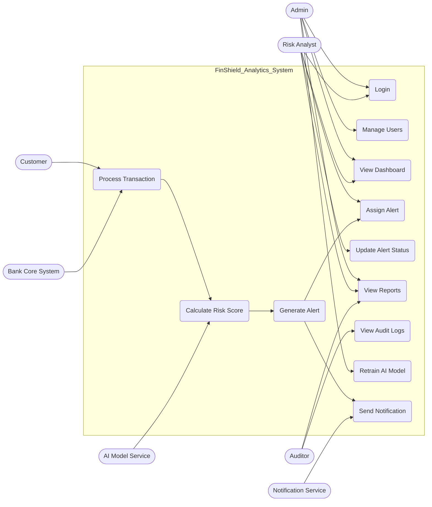

# Use Case Diagram – FinShield Analytics

```mermaid
flowchart LR

%% Actors
Admin([Admin])
Analyst([Risk Analyst])
Auditor([Auditor])
Customer([Customer])
BankAPI([Bank Core System])
AIService([AI Model Service])
Notification([Notification Service])

%% System Boundary
subgraph FinShield_Analytics_System

UC1(Login)
UC2(Manage Users)
UC3(View Dashboard)
UC4(Process Transaction)
UC5(Calculate Risk Score)
UC6(Generate Alert)
UC7(Assign Alert)
UC8(Update Alert Status)
UC9(View Reports)
UC10(View Audit Logs)
UC11(Retrain AI Model)
UC12(Send Notification)

end

%% Actor Relationships
Admin --> UC1
Admin --> UC2
Admin --> UC3
Admin --> UC9
Admin --> UC11

Analyst --> UC1
Analyst --> UC3
Analyst --> UC7
Analyst --> UC8
Analyst --> UC9

Auditor --> UC9
Auditor --> UC10

Customer --> UC4

BankAPI --> UC4
UC4 --> UC5
AIService --> UC5

UC5 --> UC6
UC6 --> UC7
UC6 --> UC12
Notification --> UC12
```